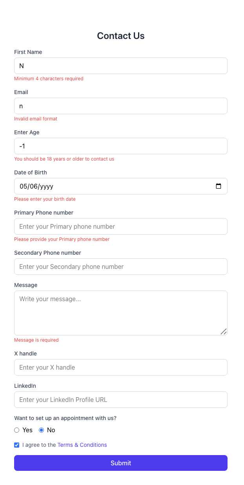

# Nexus Form

A minimal and efficient form built with [React Hook Form](https://react-hook-form.com/) using TypeScript and Vite. This example demonstrates best practices for handling form state, validation, and controlled inputs in React.




## 🚀 Features

- **React Hook Form**: Utilizes the `useForm` hook for managing form state and validation.
- **TypeScript**: Ensures type safety and enhances developer experience.
- **Vite**: Provides a fast and modern build tool for React applications.
- **Controlled Inputs**: Demonstrates the use of controlled components for form fields.
- **Validation**: Implements basic form validation to ensure data integrity.

## 📦 Installation

Clone the repository and install dependencies:

```bash
git clone https://github.com/nikitapoyarekar05/nexus-form.git
cd nexus-form
npm install
```

## 🛠️ Development

Start the development server:

```bash
npm run dev
```

Open your browser and navigate to `http://localhost:5173` to view the form in action.

## ✅ Usage

The form includes fields for user input, with validation rules applied to ensure correct data entry. Upon submission, the form data is logged to the console.

## 📄 License

This project is licensed under the MIT License.

## 🙋‍♀️ Maintainer

Built with ❤️ by [@nikitapoyarekar05](https://github.com/nikitapoyarekar05)
